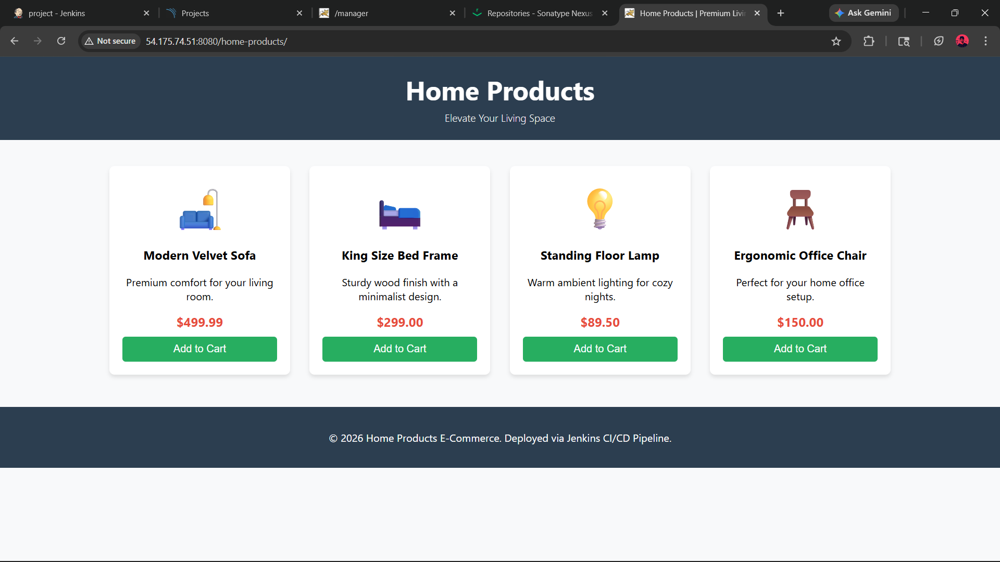
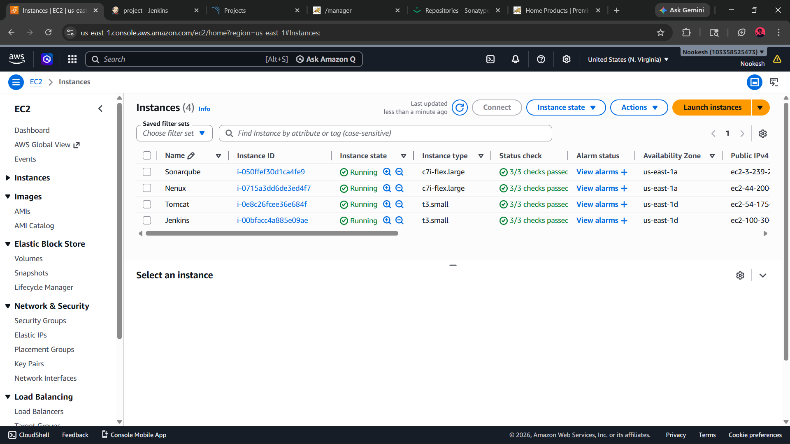
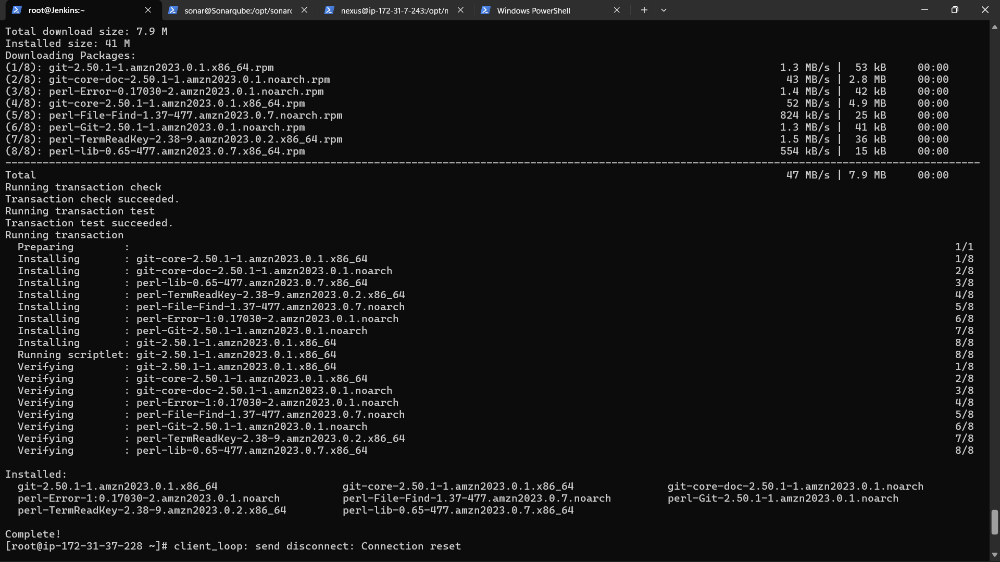
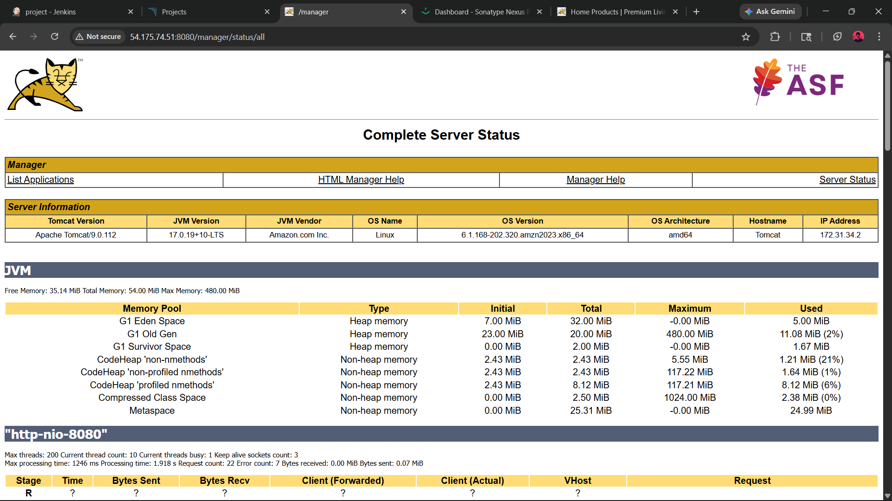
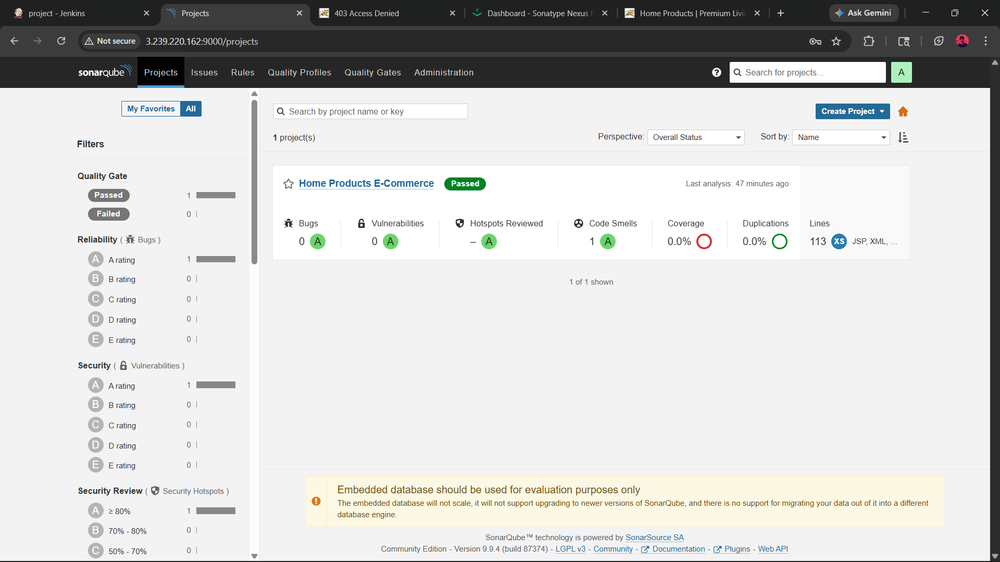
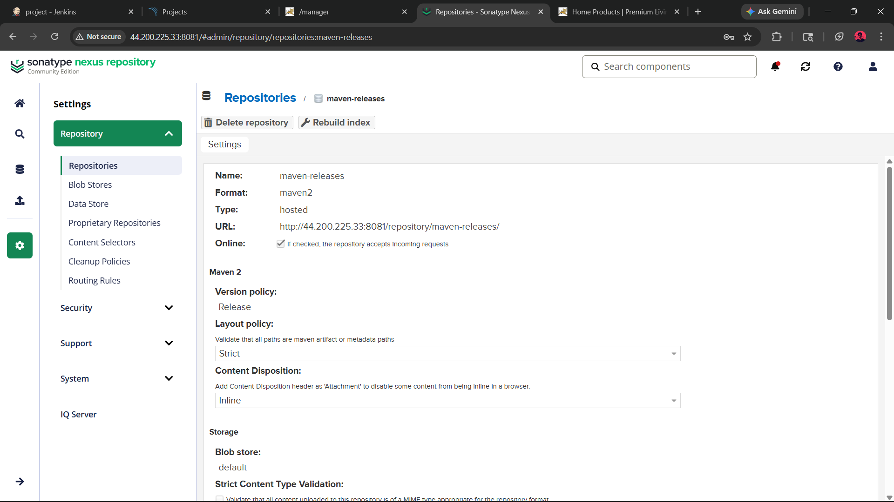
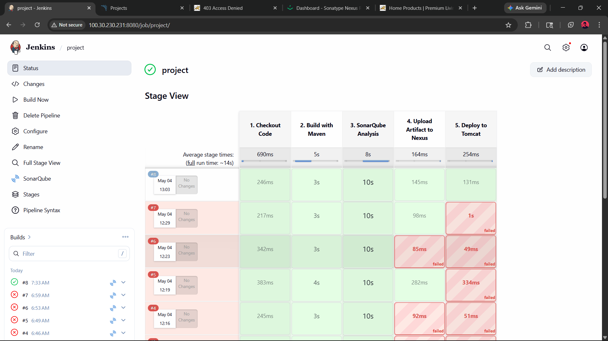

# 🚀 Enterprise CI/CD Pipeline: Java Web Application

## 📌 Overview
This project demonstrates a fully automated, continuous integration and continuous deployment (CI/CD) pipeline. It takes a raw Java-based e-commerce application from source code to a live, internet-facing web server without any manual intervention. 

## 🏗️ Architecture & Flow
1. **Developer Commits Code** ➔ GitHub Repository
2. **Continuous Integration** ➔ Jenkins pulls the code (Git)
3. **Build Stage** ➔ Maven compiles and packages the code into a `.war` file
4. **Quality Gate** ➔ SonarQube analyzes the code for bugs, vulnerabilities, and code smells
5. **Artifact Management** ➔ The artifact is securely versioned and pushed to a Sonatype Nexus repository
6. **Continuous Deployment** ➔ Jenkins deploys the artifact to a live Apache Tomcat web server

## ⚙️ Tech Stack & Infrastructure
* **Cloud:** AWS EC2 (Amazon Linux 2023)
* **Automation:** Jenkins
* **Build Tool:** Maven & Java 17
* **Code Analysis:** SonarQube (v9.9 LTS)
* **Artifact Repository:** Sonatype Nexus (v3)
* **Web Server:** Apache Tomcat (v9)

## 🛠️ Real-World Challenges Overcome
Setting up the "happy path" is easy, but real engineering happens when things break. During this build, I successfully debugged and resolved several enterprise-level configuration issues:

**1. Dependency Versioning & Environment Setup**
Resolved `maven-war-plugin` incompatibility errors by explicitly configuring the `pom.xml` to support modern Java 17 architecture. I also handled environment dependencies by manually configuring Git on the Jenkins Linux server.

**2. Security & Authentication (Tomcat)**
Debugged `HTTP 401 Unauthorized` deployment blocks by correctly formatting XML root tags in the `tomcat-users.xml` file and assigning the strict `manager-script` role for automated Jenkins deployment.

**3. Strict Quality Gates (SonarQube)**
Ensured the codebase passed strict quality analysis, resulting in 0 bugs and 0 vulnerabilities before allowing the pipeline to proceed.

**4. Artifact Version Control (Nexus)**
Managed Nexus repository policies to handle HTTP 400 redeployment rejections, ensuring strict version control limits were respected during the Maven build phase.

## 🏆 Final Pipeline Execution
After resolving the infrastructure and integration challenges, the pipeline successfully automated the entire lifecycle from GitHub to the live Tomcat server.

